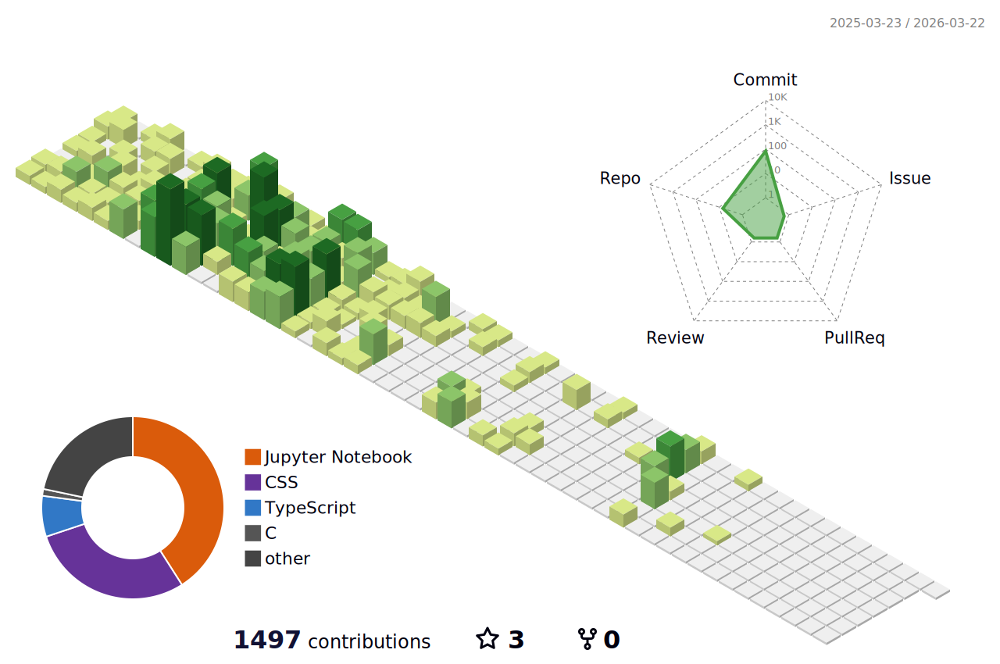

## Hi, I'm Harshita Vachhani

Welcome to my GitHub! I'm a passionate developer with a strong foundation in **C++**, **Python**, and **web development**, and a special interest in **algorithms**, **data structures**, and **Machine learning**.

### GitHub Stats

### Top Languages Used

<!--
**Harshita772/Harshita772** is a ✨ _special_ ✨ repository because its `README.md` (this file) appears on your GitHub profile.

Here are some ideas to get you started:

- 🔭 I’m currently working on ...
- 🌱 I’m currently learning ...
- 👯 I’m looking to collaborate on ...
- 🤔 I’m looking for help with ...
- 💬 Ask me about ...
- 📫 How to reach me: ...
- 😄 Pronouns: ...
- ⚡ Fun fact: ...
-->
