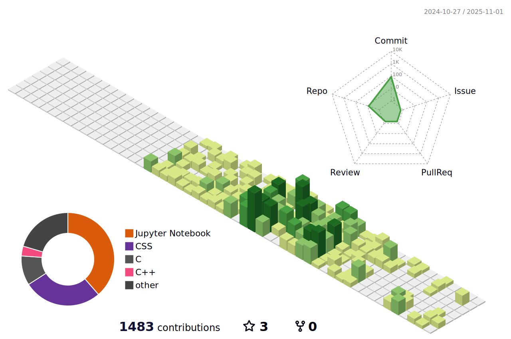

<h2 align="center"> Hi, I'm Harshita Vachhani </h2>

I'm currently a third-year B.Tech student in **Electrical Engineering** at **IIT Jodhpur** . I'm passionate about programming, problem-solving, and building meaningful projects.

- Currently exploring data science and full-stack development
- Always open to collaboration and new learning opportunities

### Connect with me on [LinkedIn](https://www.linkedin.com/in/harshita-vachhani-86340a2a0/)

### GitHub Stats

### Top Languages Used

<!--
**Harshita772/Harshita772** is a ✨ _special_ ✨ repository because its `README.md` (this file) appears on your GitHub profile.

Here are some ideas to get you started:

- 🔭 I’m currently working on ...
- 🌱 I’m currently learning ...
- 👯 I’m looking to collaborate on ...
- 🤔 I’m looking for help with ...
- 💬 Ask me about ...
- 📫 How to reach me: ...
- 😄 Pronouns: ...
- ⚡ Fun fact: ...
-->
